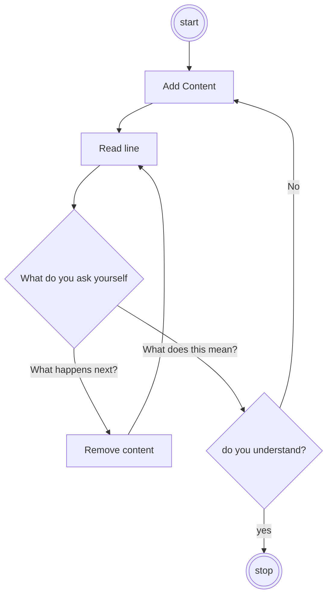
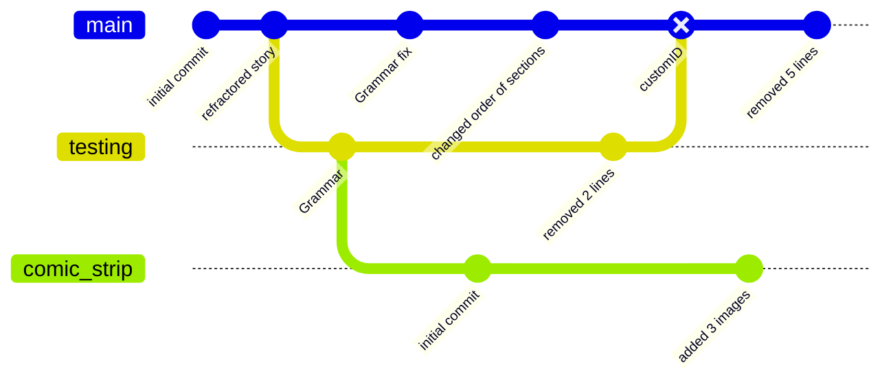

## failures

---

## experimentation
in what I can already do

---

## Framework is everything

---

<i class="fas fa-quote-left fa-2x fa-pull-left"></i>
_Every work, no matter how short or antilinear, needs momentum; the momentum of the short-short is lyrical in nature - **"what does this mean?"** - rather than narrative in nature: **"What happens next?"**_

---




---

<i class="fas fa-quote-left fa-2x fa-pull-left"></i>
_Dear Members of the cult of $done$,
I present to you a manifesto of $done$.
This was written in collaboration with [Kio Stark](http://municipalarchive.wordpress.com/) in 20 minutes because we only had 20 minutes to get it $done$._

&mdash; [Bre Pettis, 2009](https://medium.com/@bre/the-cult-of-done-manifesto-724ca1c2ff13)

---

**```failures.md``` is an everchanging, alive, project** </br>
it's progress will be carefully recorded with git

---




---
## 
| Backend | Frontend |
| ------- | -------- |
| server  | website  |

---

| Backend         | Frontend                              |
| --------------- | ------------------------------------- |
| server           | website                                  |
| story           | book                                  |

---

| Backend         | Frontend                              |
| --------------- | ------------------------------------- |
| server           | website                                  |
| story           | book                                  |
| story(semester) | visualization(story(story(semester))) |

---

 