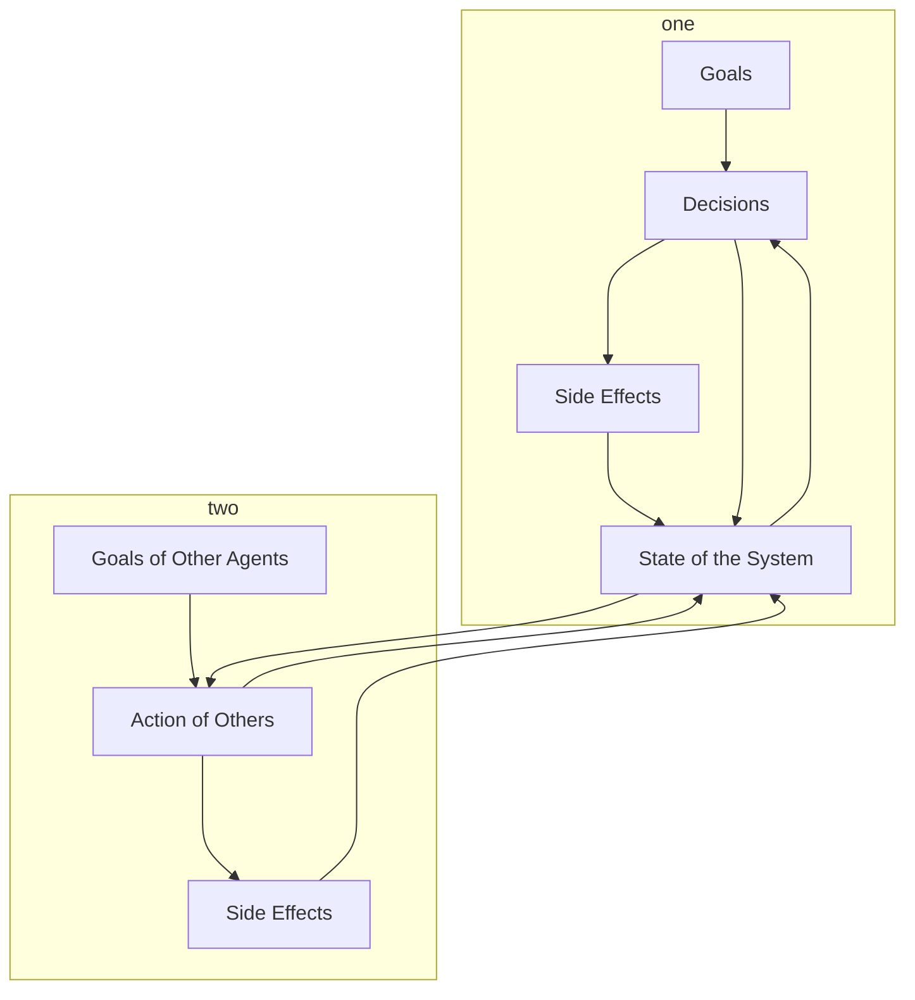

The basics of system dynamics is that everything is interconnected and one cannot remove an element without affecting the system

```mermaid
flowchart TD
	subgraph one
		A[Goals]-->B[Decisions]
		
		B--->D["Side Effects"]
		C-->B
		D-->C
	end
	B-->C[State of the System]
	subgraph two
		E[Goals of Other Agents]-->F[Action of Others]
		F--->G["Side Effects"]
		G-->C
		F-->C
		C-->F
	end
	
	
```